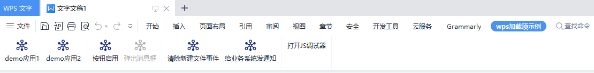
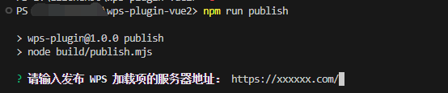
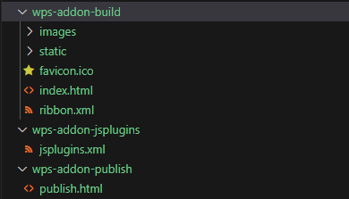

# wps-plugin-vue3

## 介绍

开箱即用的 WPS 加载项插件，使用 vue3 框架开发。

[WPS 加载项官方文档](https://open.wps.cn/docs/client/wpsLoad)

## 前置要求

### Node

`node` ，如遇版本问题，使用 [nvm](https://github.com/nvm-sh/nvm) 可管理本地多个 `node` 版本

```shell
node -v
```

### wpsjs

全局安装 wpsjs

```shell
npm install wpsjs -g
```

## 安装依赖

根目录下运行以下命令

```shell
npm install
```

## 测试环境运行

根目录下运行以下命令，运行后会自动调起本地的 WPS。

```shell
npm run debug
```



## 打包

1、根目录下运行以下命令

```shell
npm run publish
```

2、输入部署 WPS 加载项的服务器地址



3、生成打包文件



wps-addon-build: 加载项前端包，需部署到服务器

wps-addon-jsplugins: 如果使用 jsplugins.xml 模式发布插件，需将其中的 xml 文件部署到服务器。

wps-addon-publish: 如果使用 publish 模式发布插件，需将其中的 html 文件部署到服务器。

jsplugins.xml 和 publish 的模式介绍与发布详情见[WPS 加载项官方文档](https://open.wps.cn/docs/client/wpsLoad)
